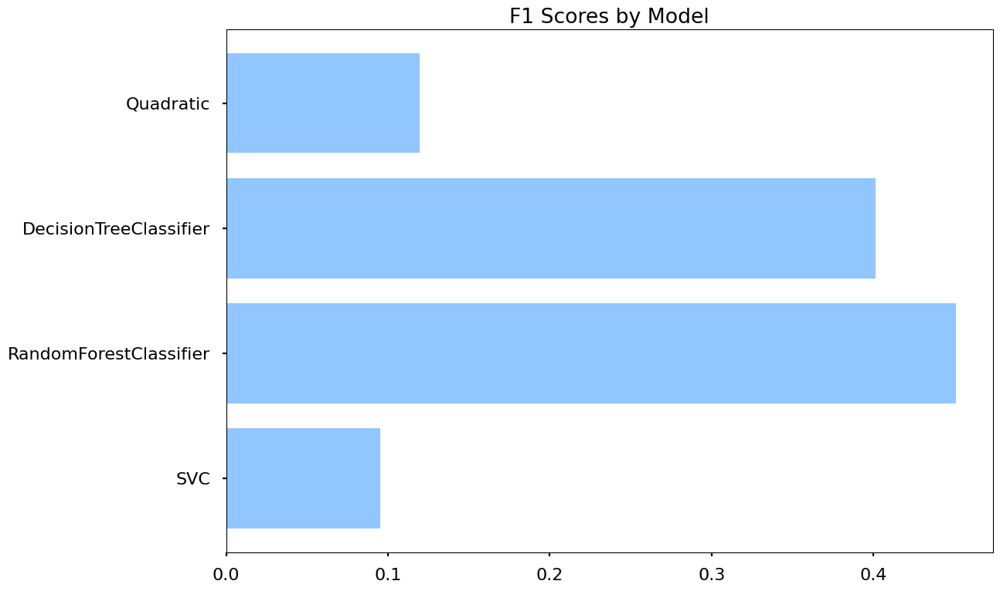

[Back to readme](README.md)  

The conclusion that I found is that my data correlates very well with decision tree models and their kind of classification. My data does not correlate well with clustering or linear regression. The result mostly fits my expectations for trying to predict a genre from a set of 16, although clustering performed worse than I expected. My best performing model, Random Forest, can predict a genre with 45% accuracy if it has the input features revenue, budget, vote count, and vote average.  

The following result can be seen within this ensemble notebook.  
[Ensemble Notbook](Ensemble.ipynb)
