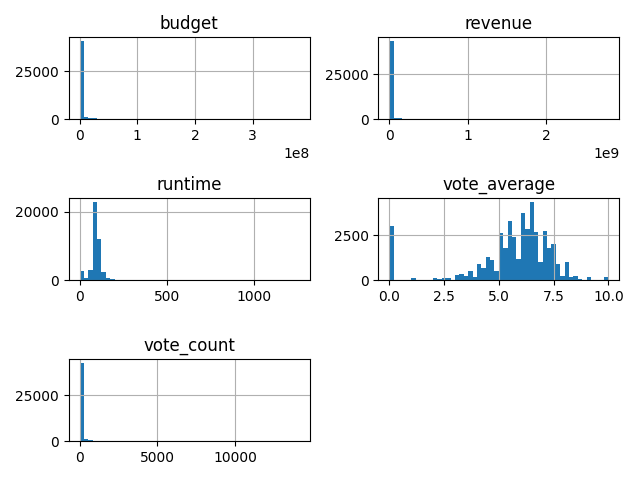
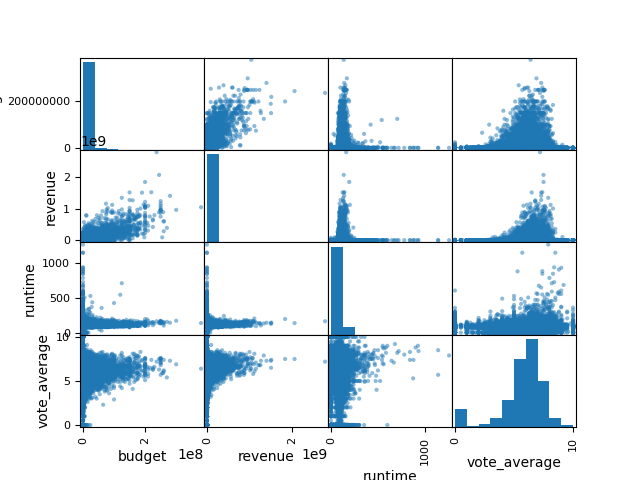

[readme](README.md)  
## Data

DataFrame info:
```
Data columns (total 24 columns):
 #   Column                 Non-Null Count  Dtype  
---  ------                 --------------  -----  
 0   adult                  45466 non-null  object 
 1   belongs_to_collection  4494 non-null   object 
 2   budget                 45466 non-null  object 
 3   genres                 45466 non-null  object 
 4   homepage               7782 non-null   object 
 5   id                     45466 non-null  object 
 6   imdb_id                45449 non-null  object 
 7   original_language      45455 non-null  object 
 8   original_title         45466 non-null  object 
 9   overview               44512 non-null  object 
 10  popularity             45461 non-null  object 
 11  poster_path            45080 non-null  object 
 12  production_companies   45463 non-null  object 
 13  production_countries   45463 non-null  object 
 14  release_date           45379 non-null  object 
 15  revenue                45460 non-null  float64
 16  runtime                45203 non-null  float64
 17  spoken_languages       45460 non-null  object 
 18  status                 45379 non-null  object 
 19  tagline                20412 non-null  object 
 20  title                  45460 non-null  object 
 21  video                  45460 non-null  object 
 22  vote_average           45460 non-null  float64
 23  vote_count             45460 non-null  float64
dtypes: float64(4), object(20)
memory usage: 8.3+ MB
```  
DataFrame description:
```
      revenue	    runtime      vote_average	vote_count
count 4.546000e+04  45203.000000 45460.000000 45460.000000
mean 1.120935e+07	94.128199	5.618207	109.897338
std	6.433225e+07	38.407810	1.924216	491.310374
min	0.000000e+00	0.000000	0.000000	0.000000
25%	0.000000e+00	85.000000	5.000000	3.000000
50%	0.000000e+00	95.000000	6.000000	10.000000
75%	0.000000e+00	107.000000	6.800000	34.000000
max	2.787965e+09	1256.000000	10.000000	14075.000000
```

Genres value count example showing contained data before transformation
```
[{'id': 18, 'name': 'Drama'}]                                                                                                         5000
[{'id': 35, 'name': 'Comedy'}]                                                                                                        3621
[{'id': 99, 'name': 'Documentary'}]                                                                                                   2723                                                                                                                      
[{'id': 18, 'name': 'Drama'}, {'id': 10749, 'name': 'Romance'}]                                                                       1301                                                                                                                                  ... 
[{'id': 28, 'name': 'Action'}, {'id': 18, 'name': 'Drama'}, {'id': 35, 'name': 'Comedy'}, {'id': 99, 'name': 'Documentary'}]
```

Please see the linked notebook for a 3-4 code block examples of how the data has been transformed.
[Transformation](Transformations.ipynb)

Histogram of Numerical Data


Scatter Matrix combinations of data
